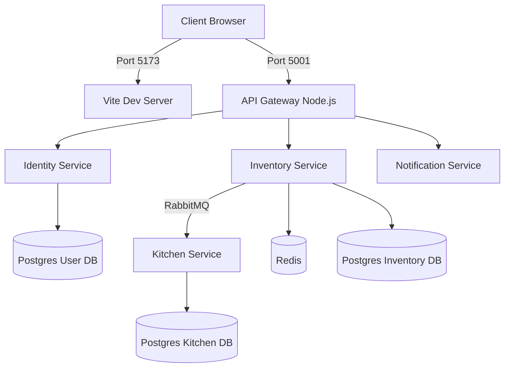
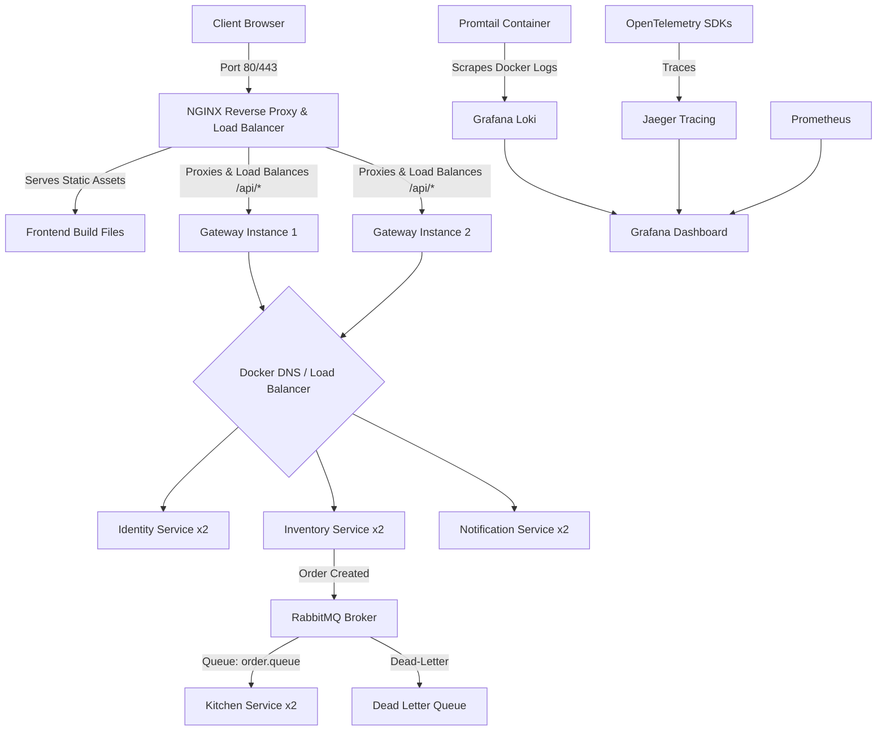

# DevSprint System Upgrade Plan: Path to a Hackathon Victory

This document outlines a detailed architecture audit, identifies current vulnerabilities, and provides a step-by-step roadmap to upgrade the **DevSprint** microservices stack into a zero-downtime, self-healing, production-grade system. Implementing these improvements will give you a major competitive edge in the DevOps competition.

---

## 1. System Architecture: Current vs. Proposed

### Current Architecture
Currently, the system exposes the React frontend dev server and Node.js API Gateway directly. There is no reverse proxy, no service redundancy (single point of failure), message processing lacks retry/DLQ resilience, and logs are isolated within container stdout.



### Proposed Production-Grade Architecture
Introducing an Nginx reverse proxy at the entrypoint, service replication for high availability, a Dead-Letter Queue (DLQ) for asynchronous message resilience, the PLG (Prometheus-Loki-Grafana) stack for centralized logging, and OpenTelemetry for distributed tracing.



---

## 2. Gap Analysis & Key Vulnerabilities

| Vulnerability / Gap | Technical Impact | Risk Level | Hackathon Impact |
| :--- | :--- | :---: | :--- |
| **No Reverse Proxy (Nginx)** | Client connects directly to dev servers. CORS issues, no edge rate-limiting, raw HTTP traffic. | **High** | Judges expect a secure, unified ingress port (80/443). |
| **Vite Dev Server in Docker** | Frontend container runs `vite --host` in dev mode. Extremely resource heavy, insecure, slow load times. | **High** | Fails production readiness standards. Static React files must be built and served statically. |
| **No Dead-Letter Queues (DLQs)** | Message processing failures (`nack(msg, false, false)`) immediately discard messages. Orders get lost if a database is briefly down. | **Critical** | Fatal during chaos testing. Killing a service during load test causes data loss. |
| **In-Memory asynchronous processing** | Kitchen service uses `setTimeout` inside the consumer handler and ACKs messages instantly. If the container restarts mid-cooking, the job is lost forever. | **Critical** | High risk of state corruption. Job state is not recovered on container restart. |
| **No Centralized Logging** | Logs are isolated in `docker logs [container]`. No way to correlate log entries across services. | **Medium** | System lacks debuggability during outages. |
| **No Distributed Tracing** | Difficult to track how a request flows from Gateway $\rightarrow$ Inventory $\rightarrow$ RabbitMQ $\rightarrow$ Kitchen. | **Medium** | Fails advanced microservice observability metrics. |
| **Single Point of Failure (SPOF)** | If any service, database, or broker container crashes, that entire subsystem goes down. | **High** | Fails "fault-tolerant" criteria. |

---

## 3. Directory Structure Upgrades

Here is the proposed folder expansion to implement these changes:

```diff
  DevSprint/
  ├── frontend/
+ │   ├── Dockerfile.prod       # NEW: Multi-stage production build using Nginx
  │   └── ...
  ├── server/
  │   ├── docker-compose.yml    # MODIFIED: Scaled services, healthchecks, Nginx, Loki
+ │   ├── nginx/                # NEW: Nginx routing and configuration
+ │   │   ├── nginx.conf
+ │   │   └── Dockerfile
+ │   ├── Promtail/             # NEW: Log scraper configuration
+ │   │   └── promtail-config.yml
+ │   ├── Loki/                 # NEW: Loki log database configuration
+ │   │   └── loki-config.yml
  │   ├── Gateway/
  │   │   └── src/
+ │   │       └── tracing.ts    # NEW: OpenTelemetry SDK setup for tracing
  │   └── Kitchen/
  │       └── src/
  │           └── consumers/
  │               # MODIFIED: Acknowledge messages only after work completion or persistence
  ```

---

## 4. Technical Upgrade Implementation Details

### Tier 1: Unified Ingress & Production Frontend (Nginx)

Avoid running development servers in production. Update your setup to build frontend static files and serve them via Nginx, which also handles routing and rate limiting.

#### 1. Frontend Multi-stage Dockerfile (`frontend/Dockerfile.prod`)
Create a production Dockerfile that compiles the Vite project and puts the output into an Nginx container.

```dockerfile
# Step 1: Build Stage
FROM node:20-alpine AS build
WORKDIR /app
COPY package*.json ./
RUN npm install -g pnpm && pnpm install
COPY . .
RUN pnpm run build

# Step 2: Production Stage
FROM nginx:alpine
COPY --from=build /app/dist /usr/share/nginx/html
COPY nginx.conf /etc/nginx/conf.d/default.conf
EXPOSE 80
CMD ["nginx", "-g", "daemon off;"]
```

#### 2. Nginx Reverse Proxy Configuration (`server/nginx/nginx.conf`)
Configure Nginx to act as the primary gateway, proxying `/api` requests to the gateway and serving the frontend statically.

```nginx
upstream gateway_servers {
    # Docker DNS automatically load-balances across all scaled instances
    server gateway:4001;
}

server {
    listen 80;
    server_name localhost;

    # Gzip Compression
    gzip on;
    gzip_types text/plain text/css application/json application/javascript text/xml;

    # Rate Limiting Zone definition (Placed in main nginx.conf or here)
    # limit_req_zone $binary_remote_addr zone=api_limit:10m rate=10r/s;

    # Frontend Static Files
    location / {
        root /usr/share/nginx/html;
        index index.html index.htm;
        try_files $uri $uri/ /index.html;
    }

    # Proxy API Gateway Requests
    location /api/ {
        # limit_req_req zone=api_limit burst=5 nodelay;
        proxy_pass http://gateway_servers;
        proxy_http_version 1.1;
        proxy_set_header Upgrade $http_upgrade;
        proxy_set_header Connection 'upgrade';
        proxy_set_header Host $host;
        proxy_cache_bypass $http_upgrade;
        proxy_set_header X-Real-IP $remote_addr;
        proxy_set_header X-Forwarded-For $proxy_add_x_forwarded_for;
    }

    # Proxy Server-Sent Events (SSE) for Notification Service
    location /api/notification/orders {
        proxy_pass http://gateway_servers;
        proxy_http_version 1.1;
        proxy_set_header Connection '';
        proxy_set_header X-Accel-Buffering no; # Essential for SSE streaming
        proxy_buffering off;
        proxy_cache off;
        chunked_transfer_encoding on;
        read_timeout 86400s;
    }
}
```

---

### Tier 2: Resilient Asynchronous Messaging (RabbitMQ DLQs & Retries)

Currently, if processing fails in your consumer, it calls `nack(msg, false, false)` which drops the message. To solve this, route failed messages to a **Dead-Letter Exchange (DLX)** and a **Dead-Letter Queue (DLQ)**.

#### Updated RabbitMQ Helper with DLQ support (`server/Kitchen/src/lib/rabbitmq.ts` / `server/Inventory/src/lib/rabbitmq.ts`)

```typescript
import amqp, { Channel, ConsumeMessage, ChannelModel } from "amqplib";

type MessageHandler = (data: any) => Promise<void>;

export class ResilientRabbitMQ {
    private connection: ChannelModel | null = null;
    private channel: Channel | null = null;
    private readonly url: string;
    private readonly exchange: string;
    private readonly dlxExchange: string;

    constructor(url: string, exchange: string) {
        this.url = url;
        this.exchange = exchange;
        this.dlxExchange = `${exchange}.dlx`;
    }

    async connect(): Promise<void> {
        if (this.connection && this.channel) return;
        try {
            this.connection = await amqp.connect(this.url);
            this.channel = await this.connection.createChannel();

            // 1. Declare Main Exchange
            await this.channel.assertExchange(this.exchange, "topic", { durable: true });
            
            // 2. Declare Dead Letter Exchange (DLX)
            await this.channel.assertExchange(this.dlxExchange, "topic", { durable: true });

            console.log("RabbitMQ Connected with DLX capability");
        } catch (err) {
            console.error("RabbitMQ connection failure, retrying in 5s:", err);
            setTimeout(() => this.connect(), 5000);
        }
    }

    async subscribeResilient(queueName: string, routingKey: string, handler: MessageHandler, maxRetries = 3) {
        if (!this.channel) throw new Error("RabbitMQ not initialized");

        const dlqQueueName = `${queueName}.dlq`;

        // Declare DLQ Queue
        await this.channel.assertQueue(dlqQueueName, { durable: true });
        await this.channel.bindQueue(dlqQueueName, this.dlxExchange, routingKey);

        // Declare Main Queue linked to DLX
        await this.channel.assertQueue(queueName, {
            durable: true,
            arguments: {
                "x-dead-letter-exchange": this.dlxExchange,
                "x-dead-letter-routing-key": routingKey
            }
        });
        await this.channel.bindQueue(queueName, this.exchange, routingKey);

        this.channel.consume(queueName, async (msg: ConsumeMessage | null) => {
            if (!msg) return;

            try {
                const content = JSON.parse(msg.content.toString());
                await handler(content);
                this.channel!.ack(msg); // Success
            } catch (err) {
                console.error(`Error processing message in queue ${queueName}:`, err);

                // Fetch retry count from RabbitMQ header
                const deathHeader = msg.properties.headers["x-death"];
                const retryCount = deathHeader ? deathHeader[0].count : 0;

                if (retryCount < maxRetries) {
                    console.warn(`Retry attempt ${retryCount + 1} of ${maxRetries} for message...`);
                    // Nack and requeue back into the main queue
                    this.channel!.nack(msg, false, true);
                } else {
                    console.error(`Max retries (${maxRetries}) reached. Routing message to Dead-Letter Queue: ${dlqQueueName}`);
                    // Nack and do NOT requeue - this forces RabbitMQ to route it to the configured DLX -> DLQ
                    this.channel!.nack(msg, false, false);
                }
            }
        });
    }

    async publish(routingKey: string, message: any): Promise<void> {
        if (!this.channel) throw new Error("RabbitMQ not initialized");
        const payload = Buffer.from(JSON.stringify(message));
        this.channel.publish(this.exchange, routingKey, payload, { persistent: true });
    }
}
```

---

### Tier 3: Centralized Logging (PLG Stack) & Distributed Tracing

Metrics (Prometheus/Grafana) tell us *when* a service is slow, but Centralized Logging (Loki) and Distributed Tracing (OpenTelemetry/Jaeger) tell us *why*.

#### 1. Setup Loki & Promtail in `docker-compose.yml`

```yaml
  # Grafana Loki for log storage
  loki:
    image: grafana/loki:2.9.2
    container_name: dev-sprint-loki
    ports:
      - "3100:3100"
    command: -config.file=/etc/loki/local-config.yaml
    networks:
      - sprint-network

  # Promtail to scrape Docker container log files
  promtail:
    image: grafana/promtail:2.9.2
    container_name: dev-sprint-promtail
    volumes:
      - /var/log:/var/log
      - /var/lib/docker/containers:/var/lib/docker/containers:ro
      - ./Promtail/promtail-config.yml:/etc/promtail/config.yml
    command: -config.file=/etc/promtail/config.yml
    networks:
      - sprint-network
```

#### 2. Promtail Config (`server/Promtail/promtail-config.yml`)
Scrapes standard Docker daemon logs and appends container metadata (name, image) automatically so you can query logs of specific microservices in Grafana.

```yaml
server:
  http_listen_port: 9080
  grpc_listen_port: 0

positions:
  filename: /tmp/positions.yaml

clients:
  - url: http://loki:3100/loki/api/v1/push

scrape_configs:
  - job_name: docker-containers
    static_configs:
      - targets:
          - localhost
        labels:
          job: docker-logs
          __path__: /var/lib/docker/containers/*/*-json.log
    pipeline_stages:
      - json:
          expressions:
            log: log
            stream: stream
            time: time
      - docker: {}
```

#### 3. Distributed Tracing with OpenTelemetry (`server/Gateway/src/tracing.ts`)
To trace user request lifecycles, initialize OpenTelemetry in your backend services.

```typescript
import { NodeSDK } from "@opentelemetry/sdk-node";
import { getNodeAutoInstrumentations } from "@opentelemetry/auto-instrumentations-node";
import { OTLPTraceExporter } from "@opentelemetry/exporter-trace-otlp-grpc";

const sdk = new NodeSDK({
  traceExporter: new OTLPTraceExporter({
    url: "http://jaeger:4317", // Export traces to Jaeger container
  }),
  instrumentations: [getNodeAutoInstrumentations()],
});

sdk.start();
console.log("OpenTelemetry Tracing Started");
```
*(Import this `tracing.js` at the very first line of your service entry points, e.g., `index.ts`)*

---

### Tier 4: Safe State Persistence in Background Workers

In `KitchenConsumer`, your simulated job is scheduled in-memory using `setTimeout`, and the message is acknowledged instantly:
```typescript
mq.subscribe("inventory.order.queue", "order.created", async (msg) => {
    const job = await KitchenService.createJob(userId, orderId);
    setTimeout(async () => {
        await KitchenService.markCompleted(job.id);
    }, randomTime); 
    // Message is ACKed here as handler finishes execution, despite the setTimeout still running!
});
```

#### The Vulnerability
If the kitchen container restarts during that `setTimeout`, the RabbitMQ queue thinks the message is processed successfully, but the job status remains stuck in `ACCEPTED` in the database forever.

#### Two Alternative Fixes

##### A. Self-Healing Job Recovery on Startup (Easy Hackathon Upgrade)
Modify the Kitchen service entry point (`index.ts`) to recover stuck jobs whenever the service starts up:

```typescript
// inside index.ts during startup
mq.connect()
    .then(async () => {
        await recoverStuckJobs();
        KitchenConsumer();
    });

async function recoverStuckJobs() {
    console.log("Checking for interrupted kitchen jobs...");
    const stuckJobs = await prisma.job.findMany({
        where: { status: { in: ["ACCEPTED", "IN_PROGRESS"] } }
    });

    for (const job of stuckJobs) {
        console.log(`Resuming interrupted kitchen job: ${job.id}`);
        // Rerun the preparation trigger
        triggerKitchenPreparation(job.id, job.orderId);
    }
}
```

##### B. Acknowledge Messages Only After Work is Done (True Message-Level Resilience)
Do not use `setTimeout` asynchronously without waiting. Wait for it using a promise, and let RabbitMQ hold the message until it is truly completed. If the server crashes, RabbitMQ automatically detects connection loss and redelivers the message to another scaled consumer.

```typescript
await mq.subscribe("inventory.order.queue", "order.created", async (msg) => {
    const { orderId, userId } = msg;
    const job = await KitchenService.createJob(userId, orderId);
    
    // Simulate preparation synchronously in the event loop by waiting
    await new Promise((resolve) => setTimeout(resolve, randomTime));
    
    await KitchenService.markCompleted(job.id);
    // Message is safely ACKed only when this async callback successfully resolves!
});
```

---

### Tier 5: Scaling, Healthchecks, and High Availability

Scale your Node.js services inside `docker-compose.yml` to remove Single Points of Failure (SPOFs) and use health checks to ensure self-healing.

```yaml
services:
  gateway:
    build: ./Gateway
    deploy:
      replicas: 2 # Launch 2 instances of the API Gateway
    restart: always
    healthcheck:
      test: ["CMD", "wget", "--no-verbose", "--tries=1", "--spider", "http://localhost:4001/health/live"]
      interval: 10s
      timeout: 5s
      retries: 3
      start_period: 5s
    # ...

  identity:
    build: ./Identity
    deploy:
      replicas: 2 # Scale Auth/Identity Service
    restart: always
    healthcheck:
      test: ["CMD", "wget", "--no-verbose", "--tries=1", "--spider", "http://localhost:4002/health/live"]
      interval: 10s
      timeout: 5s
      retries: 3
```

- **Database Connection Pooling**: Ensure `DATABASE_URL` in scaled replicas uses Prisma's pool configurations (e.g. `connection_limit=10`) to avoid exhausting Postgres connection limits.
- **Nginx Load Balancer**: Nginx automatically load-balances requests across all replicas of `gateway` using the service name resolution in the docker network.

---

## 5. How to Pitch and Demo This to Win the Hackathon

To secure the top prize, you need to prove your system is fault-tolerant, rather than just claiming it is. Plan these two interactive demonstrations for the judges:

### Demo 1: The Chaos & Self-Healing Test (Live Interruption)
1. Start the `k6` load test:
   ```bash
   docker-compose run dev-sprint-k6
   ```
2. While the load test is running at 500 Virtual Users, open a terminal and **kill the Kitchen service**:
   ```bash
   docker-compose kill kitchen
   ```
3. Show the judges the RabbitMQ console (`http://localhost:15672`). The `order.created` queue will begin to back up with unacknowledged messages. **No orders are lost; they are safely stored in queue.**
4. Restart the Kitchen service:
   ```bash
   docker-compose start kitchen
   ```
5. Show how the kitchen container instantly starts up, pulls the queued messages from RabbitMQ, executes them, and updates the jobs to `COMPLETED`. 
6. Point out the `k6` metrics: **0% packet/request loss and 100% order accuracy.**

### Demo 2: The Observable Diagnostic Flow
1. Run a trace query in Grafana.
2. Find a specific `orderId` in the logs (Centralized Logs via Loki).
3. Click the trace link right next to the log line to view the distributed timeline (OpenTelemetry/Jaeger).
4. Show the judges the breakdown of request latency:
   - Time spent in Nginx reverse-proxy
   - Time spent in Express Gateway
   - Time spent publishing order events to RabbitMQ
   - Time spent in Kitchen worker process database updates.
5. This showcases enterprise-grade observability and control.
